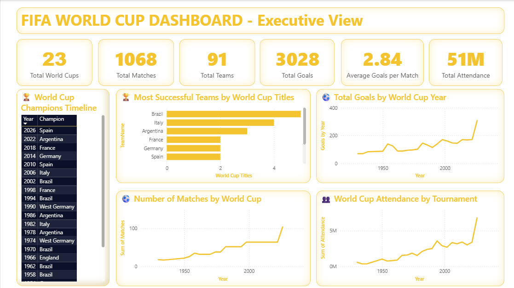
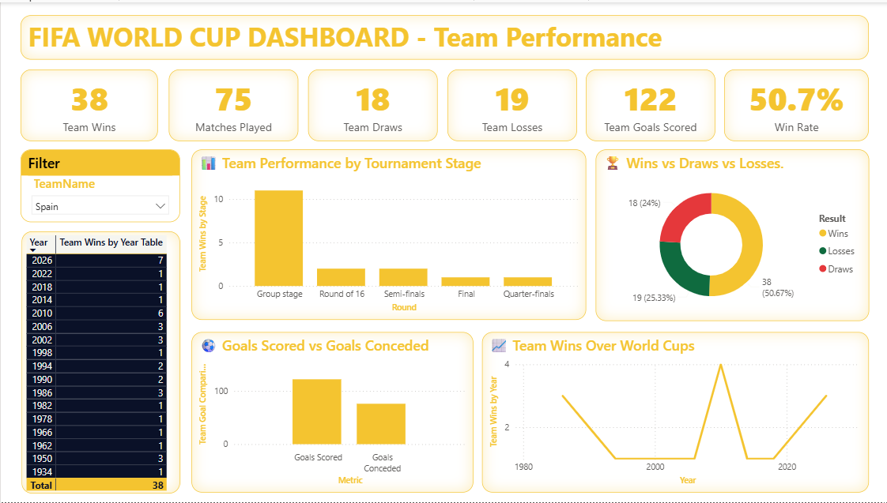
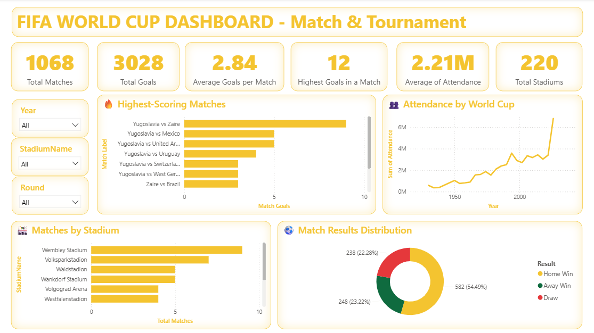
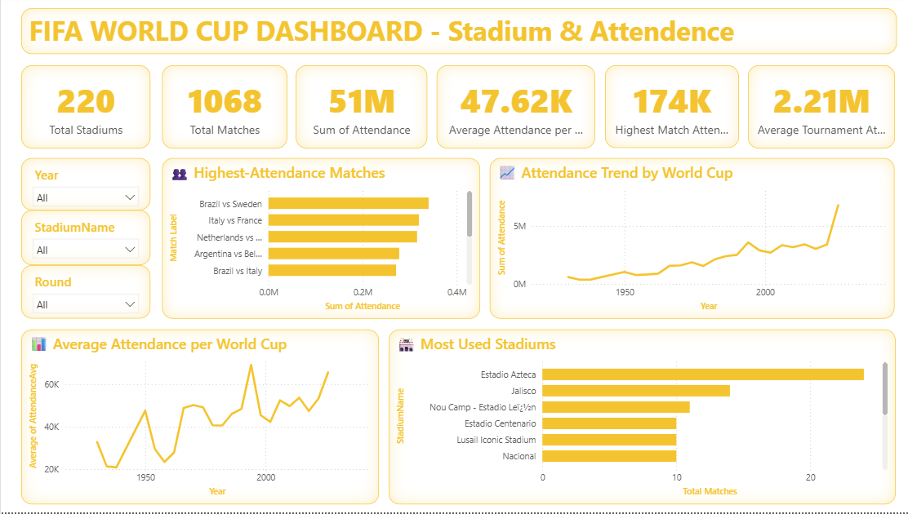

# FIFA World Cup Analytics & 2030 Prediction

An end-to-end data analytics project analyzing FIFA World Cup history from 1930 to 2026 using SQL Server, Power BI, and Python.

The project combines historical World Cup data, match-level analysis, team performance, stadium and attendance analytics, and a planned machine learning component for 2030 World Cup prediction.

---

## 📌 Project Overview

This project analyzes FIFA World Cup tournaments from 1930 through 2026 to uncover insights into:

- Tournament history and champions
- Team performance
- Match results and goals
- Tournament stages
- Stadium utilization
- Match attendance
- Historical team performance trends
- 2026 World Cup integration

The next phase will use Python and machine learning to develop a probability-based model for analyzing potential outcomes of the 2030 FIFA World Cup.

---

## 🎯 Project Objectives

- Build a structured FIFA World Cup relational database
- Analyze 1930–2026 tournament history
- Measure team performance across tournaments
- Analyze goals, wins, draws, and losses
- Analyze stadium usage and attendance
- Build an interactive Power BI dashboard
- Prepare a machine learning dataset for 2030 prediction
- Develop probability-based predictions rather than deterministic outcomes

---

## 🗄️ Data & Database

The project uses SQL Server as the primary data storage and analysis layer.

### Historical Data

World Cup data covering:

**1930–2026**

The database includes:

- World Cup tournaments
- Teams
- Matches
- Stadiums
- Referees
- Match results
- Goals
- Attendance
- Tournament stages

### Database Architecture

The project follows a relational/star-schema approach with:

- `DimWorldCup`
- `DimTeam`
- `DimStadium`
- `DimReferee`
- `FactMatch`

Staging tables are used for data ingestion and integration.

---

## 📊 Power BI Dashboard

The Power BI dashboard contains four analytical pages covering World Cup history, team performance, match analysis, and stadium attendance.

### Page 1 — World Cup Overview

Provides a high-level overview of FIFA World Cup history from 1930 to 2026.

Key metrics include:

- Total World Cups
- Total Matches
- Total Goals
- Average Goals per Match
- Total Teams
- Total Attendance
- World Cup Champions



---

### Page 2 — Team Performance Analysis

Analyzes team-level performance across World Cup tournaments.

Key metrics include:

- Matches Played
- Wins
- Draws
- Losses
- Win Rate
- Goals Scored
- Goals Conceded
- Tournament Performance
- Results by World Cup



---

### Page 3 — Match & Tournament Analysis

Provides detailed analysis of matches and tournament stages.

Key analysis includes:

- Match Results
- Goals per Match
- Tournament Stages
- Stadium-based Match Analysis
- Match Result Distribution
- Highest-scoring Matches



---

### Page 4 — Stadium & Attendance Analysis

Analyzes stadium utilization and World Cup attendance patterns.

Key analysis includes:

- Stadium Usage
- Top Stadiums by Matches
- Highest-attendance Matches
- Attendance Trends
- Average Attendance by World Cup



---

## 🏆 2026 World Cup Integration

The 2026 FIFA World Cup data was integrated into the existing historical database.

The integration includes:

- 104 matches
- 48 participating teams
- 16 venues
- Match-level attendance
- Tournament stages
- Referees
- Team mappings
- Match scores
- Expected goals (xG)

After integration, the analytical dataset contains:

| Metric | Value |
|---|---:|
| World Cups | 23 |
| Matches | 1,068 |
| Teams | 91 |
| Goals | 3,028 |
| Stadiums | 220 |

---

## 📈 Key Historical Insights

The completed analytics phase provides insights into:

- World Cup championship history
- Team win performance
- Goals scored across tournaments
- Match result distributions
- Tournament attendance trends
- Stadium utilization
- Highest-attendance matches
- Team performance across World Cups

### Example Analysis Areas

**Team Performance**

The dashboard allows users to select individual teams and analyze their:

- Matches played
- Wins
- Draws
- Losses
- Win rate
- Goals scored
- Goals conceded
- Performance by tournament

**Match Analysis**

Historical matches can be analyzed by:

- World Cup
- Tournament stage
- Stadium
- Match result
- Goals scored

**Attendance Analysis**

The dashboard provides insights into:

- Attendance trends
- Stadium utilization
- Highest-attendance matches
- Average attendance by tournament

---

## 🐍 Machine Learning — 2030 Prediction

The machine learning phase will be developed using Python.

The model will use historical and international football performance data to engineer features such as:

- FIFA ranking
- Elo rating
- Recent form
- Goals scored
- Goals conceded
- Opponent strength
- World Cup performance
- Historical team performance

Potential models include:

- Logistic Regression
- Random Forest
- Gradient Boosting
- XGBoost

Model performance will be evaluated using appropriate classification and probability metrics.

The final objective is to produce **probability-based predictions for 2030**, rather than claiming a certain tournament winner.

---

## 🛠️ Technologies Used

| Technology | Purpose |
|---|---|
| SQL Server | Database design, integration and analysis |
| SQL | Data transformation and analysis |
| Power BI | Interactive dashboard |
| DAX | Power BI calculations |
| Power Query | Data preparation |
| Python | Data preparation and machine learning |
| Pandas | Data manipulation |
| NumPy | Numerical analysis |
| Scikit-learn | Machine learning |
| XGBoost | Gradient boosting models |
| Git & GitHub | Version control and project deployment |

---

## 📁 Repository Structure

```text
FIFA-World-Cup-Analytics-2030-Prediction/
│
├── 02_Data_Quality_Report/
│
├── 03_SQL/
│   ├── 01_Database_Setup/
│   ├── 02_Staging/
│   ├── 03_Data_Integration/
│   └── 05_Analysis/
│
├── 04_Python/
│
├── 05_PowerBI/
│   └── FIFA_WorldCup_DB_Dashboard.pbix
│
├── 06_Machine_Learning/
│
├── 07_Documentation/
│
├── 08_GitHub/
│   └── Dashboard_Screenshots/
│       ├── 01_World_Cup_Overview.png
│       ├── 02_Team_Performance.png
│       ├── 03_Match_Tournament_Analysis.png
│       └── 04_Stadium_Attendance_Analysis.png
│
├── .gitignore
│
└── README.md

---

## 👨‍💻 Author

**Rahul Lal**

Data Analyst | SQL | Power BI | Python | Data Analytics